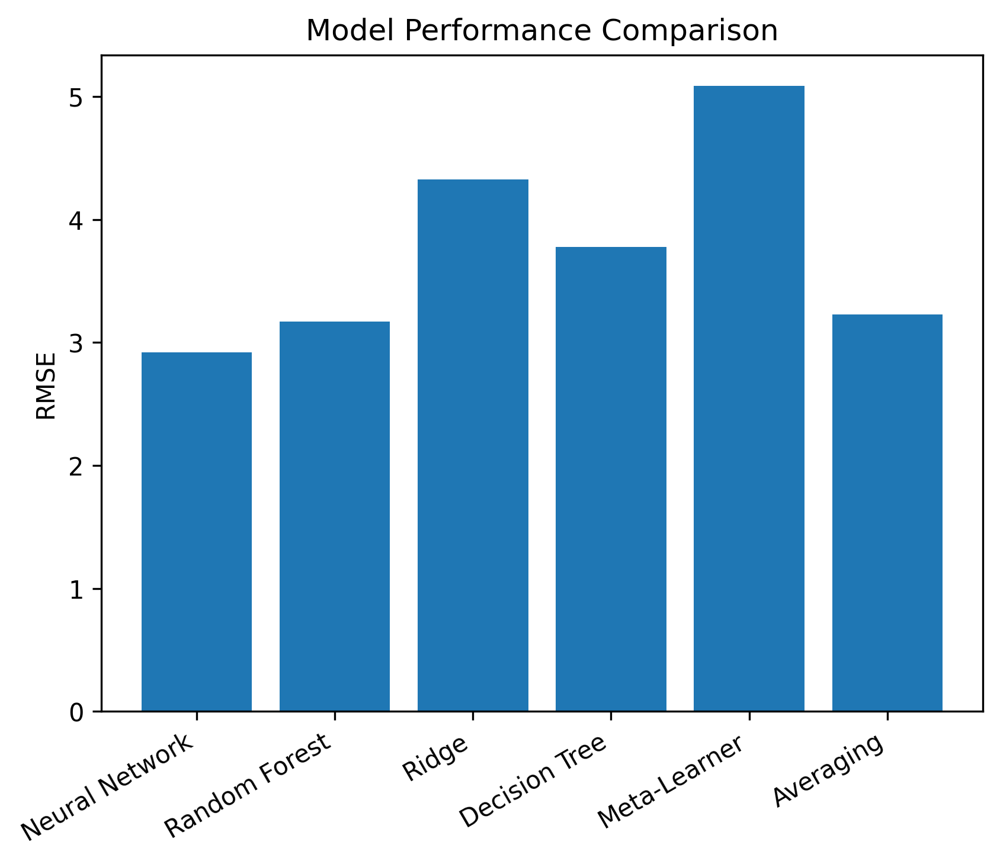

# Hand-Pose-Prediction-from-sEMG-Signals
## Project Overview
This project focuses on predicting 51 hand joint angles from 8 surface electromyography (sEMG) signals using machine learning methods.
## Dataset

The dataset contains surface electromyography (sEMG) signals and corresponding hand poses collected from one participant.

The participant repeated five predefined hand postures using a VR interface.

Training data:

- guided_dataset_X.npy → shape (5, 8, 230000) (for session, electrode, time)
- guided_dataset_y.npy → shape (5, 51, 230000)

Test data:

- guided_testset_X.npy → shape (5, 332, 8, 500) (for session, window, electrode, time)

## Methods

### Sliding Windows

We segment the sEMG signals into sliding windows. This allows us to estimate the hand pose at time t using the signals from the 8 electrodes over the time interval [t − h, t], where h is the window size.

### Cross-Validation Strategy

We used 5-fold cross-validation for model evaluation.

This approach provides a better estimation of model performance than a simple train-test split, since each data point is reused multiple times while maintaining separation between training and validation sets.

It is also computationally more efficient than leave-one-out cross-validation given the size of the dataset.

Since windows are generated independently for each session, using 5 folds ensures that no data leakage occurs between training and validation sets.

### Feature Extraction

Instead of working directly with the raw signals, we extract features from each window.

This significantly reduces the dimensionality of the data. Each window originally consists of a 500 × 8 matrix (500 time points and 8 electrodes). After feature extraction, each window is represented by 9 features per electrode, resulting in 72 features in total.

### Principal Component Analysis (PCA)

To further reduce dimensionality and handle correlations between features, we apply Principal Component Analysis (PCA).

PCA also helps reduce noise, since noise typically contributes less variance than the actual muscle signals.

However, PCA reduces interpretability because the components are linear combinations of the original features. For this reason, some models (such as Neural Networks) are trained without PCA.

### Models

We implemented several regression models:

- Ridge Regression
- Decision Trees
- Random Forests
- Neural Networks

### Ensemble Strategy

We combined model predictions using averaging and a meta-learning approach in order to improve predictive performance and reduce overfitting.

Model performance was evaluated using:

- RMSE (Root Mean Squared Error)
- NMSE (Normalized Mean Squared Error)

## Results
### RMSE Comparison

